# eCourse

## Hi!
This web application will manage online courses.

## Table of contents
* [How to set up this app locally](#How-to-set-up-this-app-locally)
* [How to run an app](#How-to-run-an-app)
* [Use cases](#Use-cases)
* [API spec](#Api-spec)
* [How to migrate DB](#db-migration)

## How to set up this app locally

* [How to set up Database](#Database)
* [How to set up Backend](#Backend)
* [How to set up Frontend](#Frontend)

### Database

* Install PostgreSQL 14 
* Create database called "ecourse"
* Create .\src\main\resources\application.properties file with code:
``` 
spring.jpa.database=POSTGRESQL
spring.jpa.show-sql=false
spring.jpa.hibernate.ddl-auto=none
spring.datasource.driverClassName=org.postgresql.Driver
spring.datasource.url=jdbc:postgresql://localhost:5432/ecourse
spring.datasource.username=USERNAME
spring.datasource.password=PASSWORD
spring.mvc.pathmatch.matching-strategy=ant_path_matcher
logging.file.name=myapp.log
```
* Replace spring.datasource.username and spring.datasource.password with your real credentials
* Connect application to this database
* Test your connection

### Backend

### Frontend

In your project directory change directory into frontend project using (on Windows)
```bash=
cd .\frontend\ecourse\ 
```
after this, start frontend application using
```bash=
npm start
```
Application should start successfully on port 3000. Local address: http://localhost:3000
## API specification
Swagger OpenAPI is available on http://localhost:8080/swagger-ui/index.html?configUrl=/v3/api-docs/swagger-config
after starting application.
Example view:
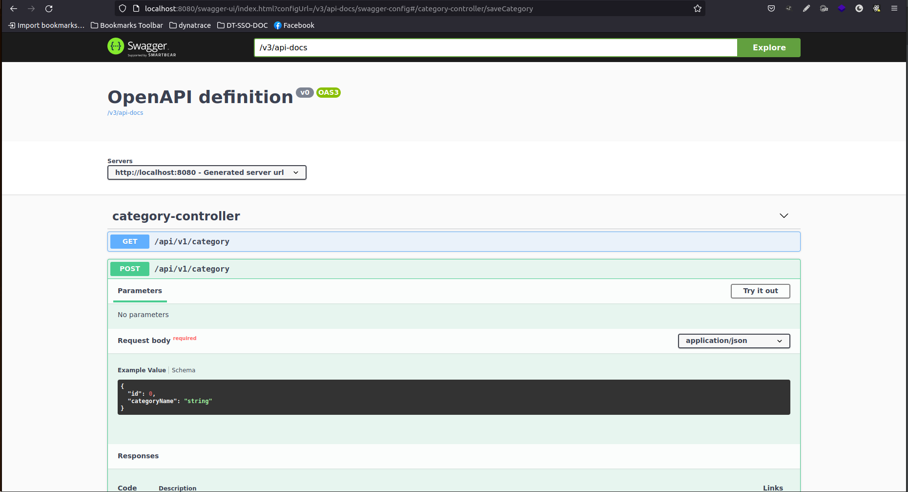
## How to run an app

## How to migrate DB
Fill your DB credentials in `build.gradle` file and then run:
`./gradlew flywayMigrate`.
It will migrate all `SQL` files from `/ecourse/src/main/resources/db.migration` folder.

## Use cases
All use cases are available on [Figma](https://www.figma.com/file/aduqkrC7mxm79UCrxeZWGy/WNDTAW?node-id=2%3A51)
* **As a** guest user **I want to** create my profile **so that I can** login with my credentials
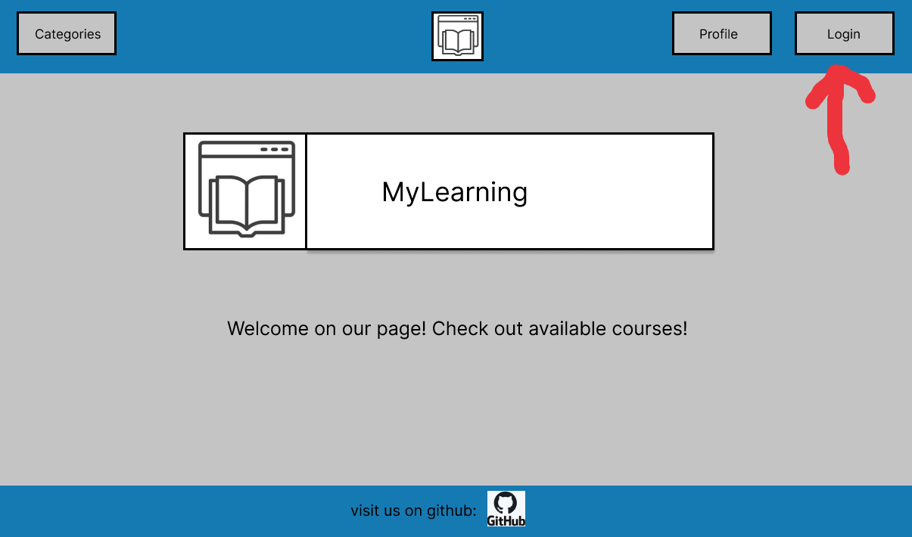
To create an account go to Login page
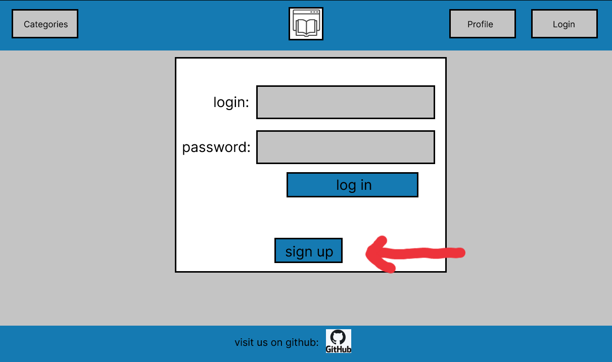
Click sign up button
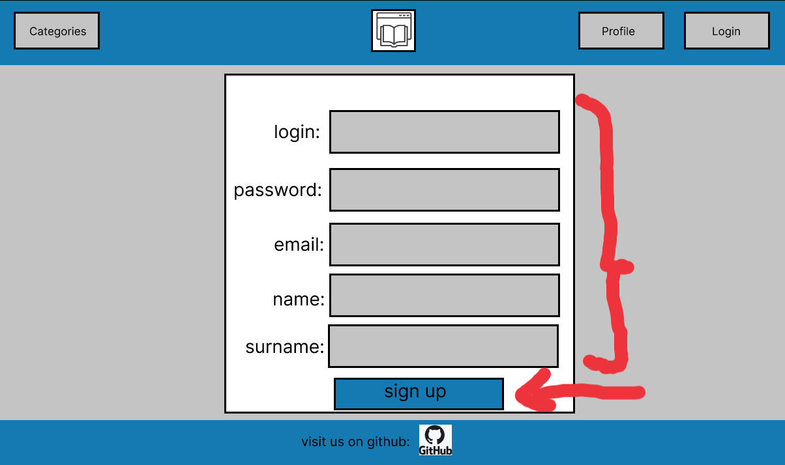
Provide necessary credentials and click sign up
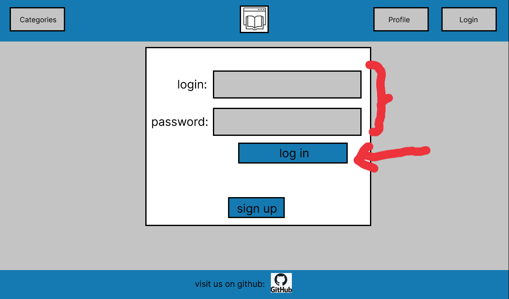
Congratulations! now you can use your credentials to log in


* **As a** user **I want to** enroll to some course **so that I can** access it
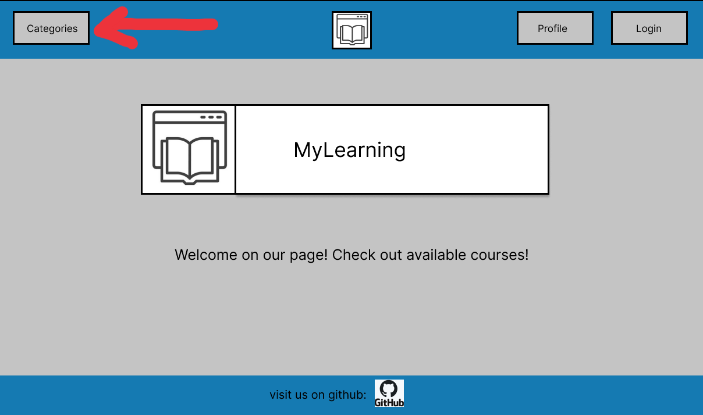
Go to categories page
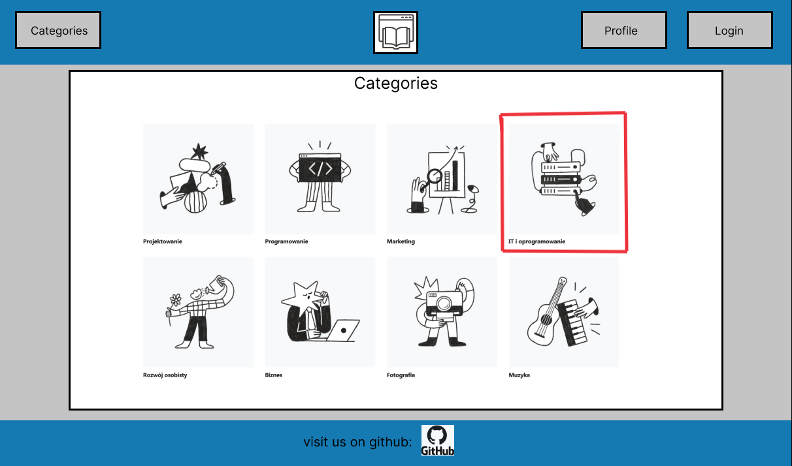
Select category of course
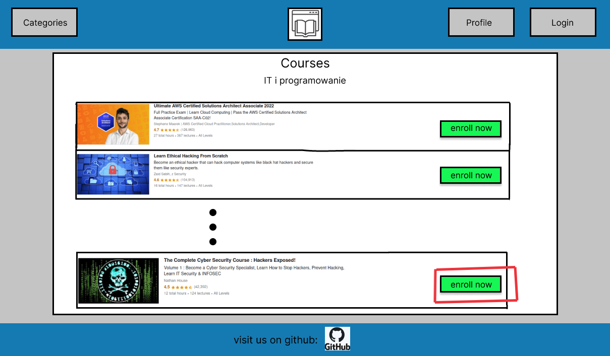
Select course by clicking 'enroll now' button
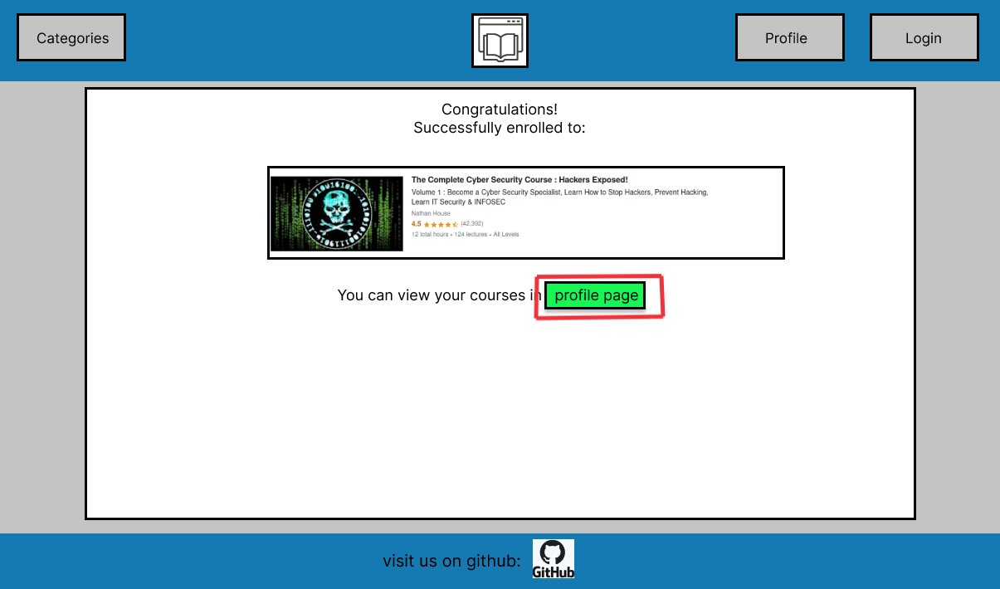
You can view your courses in profile page
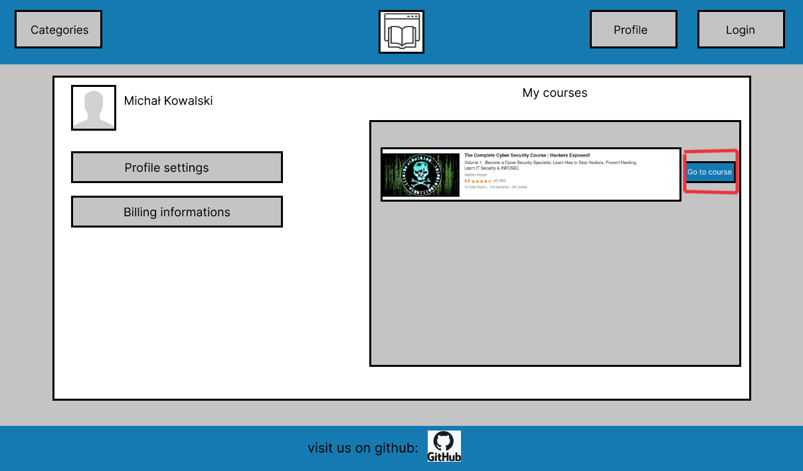


* **As an** admin **I want to** delete and create courses **so that I can** manage website 
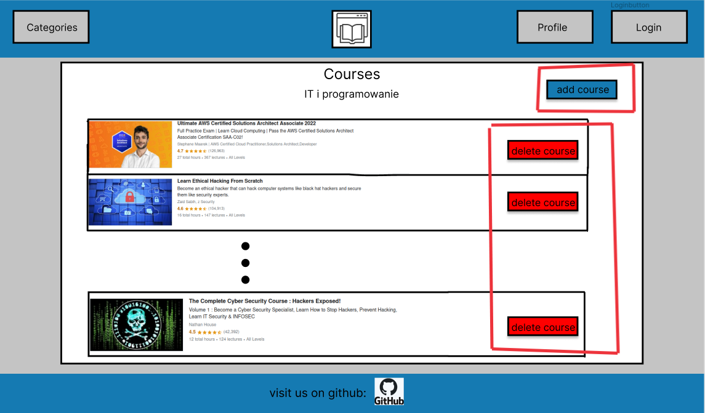
After logging in as an admin you can delete and create courses in courses page

### Technologies

**Backend**
- Java 17
- Spring Framework
- Spring Boot
- Spring JPA
- Gradle
- PostgreSQL
- REST API
- Log4j2

**Frontend**
- TypeScript
- React
